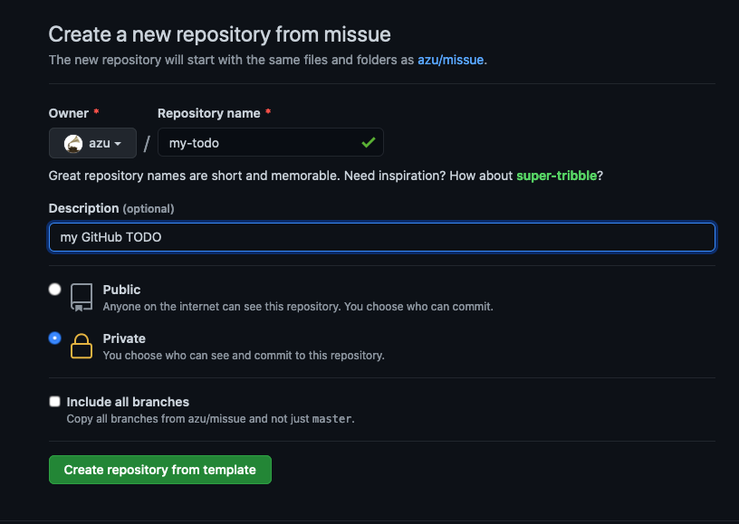

# missue

A Toolkit help you to management your TODO based on GitHub Issues.

## Usage

> This repository is template.

You can create new TODO repository based on this repository, and you can start to manage your TODO.

1. Visit <https://github.com/azu/missue/generate>
2. Input Repository name. Example) my-todo
3. Select "Public" or "Private"
4. Click "Create repository from template"



### Setup

#### Setup TODO labels workflow

You can create TODO-like labels for your repository with 1 click.

1. Visit <https://github.com/<your-name>/<your-repo>/actions?query=workflow%3A%22Sync+Cross+Reference+Issues%22>
2. Click "Run workflow"
3. Setup labels for your repository

#### Sync "CR" issue's state

"CR" is Cross Reference Issues.

You can create Cross Reference Issues with [userscript](userscript/)

Cross Reference Issues has a link that you want to track and has "CR" label.

- Example: https://github.com/azu/missue/issues/4

Sync "CR" workflow can sync state between original issue and your CR issue.

1. Visit <https://github.com/<your-name>/<your-repo>/actions?query=workflow%3A"Sync+Cross+Reference+Issues">
2. Click "Run workflow"
3. Sync CR issue's state

### Client

You can get simple electron client.

missue client has following features:

- Sync "CR" issues on focus
- Has simple Webview starts with your TODO repository

Build Steps:

```
git clone https://github.com/azu/missue
cd missue/
cd client/
yarn intall
GITHUB_TOKEN=yourtoken npm run build
```

## Changelog

See [Releases page](https://github.com/azu/missue/releases).

## Running tests

Install devDependencies and Run `npm test`:

    npm test

## Contributing

Pull requests and stars are always welcome.

For bugs and feature requests, [please create an issue](https://github.com/azu/missue/issues).

1. Fork it!
2. Create your feature branch: `git checkout -b my-new-feature`
3. Commit your changes: `git commit -am 'Add some feature'`
4. Push to the branch: `git push origin my-new-feature`
5. Submit a pull request :D

## Author

- azu: [GitHub](https://github.com/azu), [Twitter](https://twitter.com/azu_re)

## License

MIT © azu

## Aknowledge

- [jonabc/sync-task-issues: Sync task issue closure to hierarchical parent tracking issues](https://github.com/jonabc/sync-task-issues)
